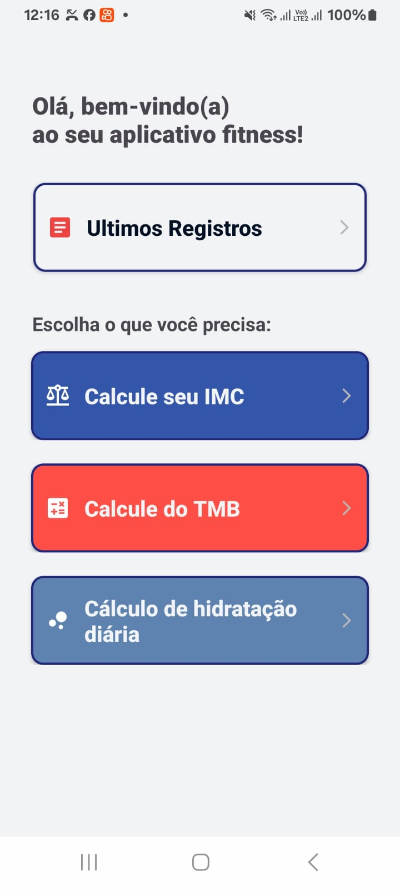

# My Fitness Lifestyle

🧾 Visão Geral

My Fitness Lifestyle é um app Android focado em bem-estar físico, que oferece ferramentas para cálculo de saúde e controle de registros pessoais. Ele possui uma interface simples com cinco telas principais, sendo a tela inicial e quatro funcionalidades específicas acessadas por botões.

🗂 Estrutura de Telas

1. Tela Inicial
  A primeira tela do aplicativo serve como menu principal e contém 4 botões, cada um direcionando para uma funcionalidade diferente:
  
  Botão 1: Últimos Registros
  
  Botão 2: Cálculo de IMC
  
  Botão 3: Cálculo de TMB
  
  Botão 4: Consumo Diário de Água

2. Tela – Últimos Registros
  Lista os registros salvos no banco de dados local (SQLite).
  
  Cada item possui opções:
  
  Editar: Abre os dados em um formulário para alteração.
  
  Excluir: Remove o item do banco de dados.
  
  Funcionalidades:
  Leitura, edição e exclusão de dados armazenados.
  
  Banco de dados implementado com SQLite (armazenamento local).

3. Tela – Cálculo de IMC (Índice de Massa Corporal)
  Formulário com campos para:
  
  Peso (kg)
  
  Altura (cm)
  
  Após o preenchimento, exibe o resultado do IMC com a classificação (ex: "peso normal", "sobrepeso", etc).

4. Tela – Cálculo de TMB (Taxa Metabólica Basal)
  Formulário com campos para:
  
  Peso
  
  Altura
  
  Idade
  
  Frequência de Treino
  
  Após envio, exibe o resultado da TMB em kcal/dia.

5. Tela – Consumo Diário de Água
Formulário com campo para:

  Peso corporal
  
  Retorna a quantidade recomendada de água por dia (ex: 35ml por kg de peso corporal).
  
  🧰 Tecnologias Utilizadas
  Kotlin para desenvolvimento Android
  
  Android Studio como IDE
  
  SQLite para armazenamento local de dados
  
  Material Design para componentes visuais (opcional)

  ## Screenshots

  Aqui estão algumas capturas de tela do aplicativo:

  

  
